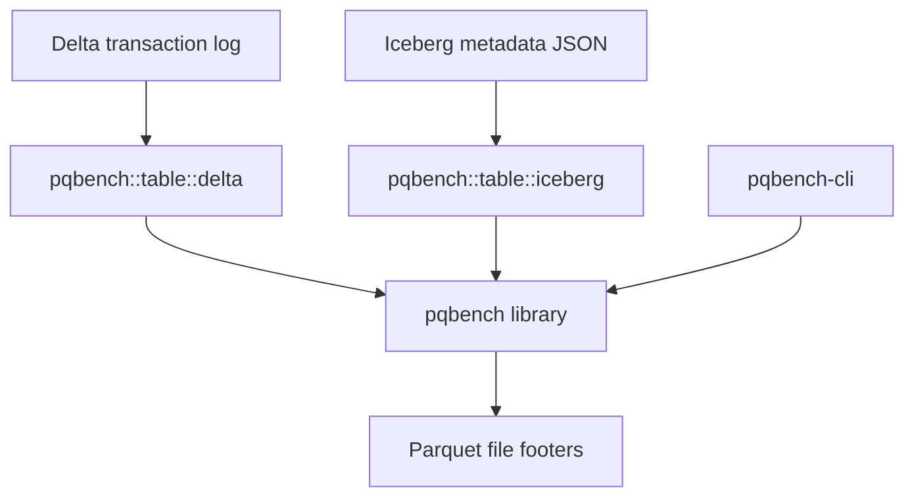

# pqbench

*lzbench for parquet.*

`pqbench` is a small command-line tool for measuring parquet (and raw file)
compression behavior: how well each codec compresses a file's bytes, how fast it
compresses/decompresses them, and how big each column is on disk. It is
dependency-light, reads only what it needs, and keeps measurement separate from
presentation so its output can be fed to other tools.

The `pqbench` library also contains an optional Delta Lake table module that
resolves a snapshot and orchestrates footer analysis across its active Parquet
files. Delta dependencies are feature-gated and remain out of the default
dependency graph.



`pqbench` reads metadata from individual Parquet files. The Delta module uses
delta-rs to select a table snapshot, passes each active file to `pqbench`, and
aggregates the results.

## Build

```
cargo build --release
```

The workspace requires Rust 1.91.1 or newer, matching the minimum required by
delta-rs 0.32.4 when the optional Delta feature is enabled.

For development, prefer `cargo check` and normal debug builds. Release builds
perform substantially more optimization and should be reserved for benchmarks
and release artifacts.

The repository automatically uses [`sccache`](https://github.com/mozilla/sccache)
when it is available and falls back to `rustc` when it is not. Install it once:

```
cargo install sccache
```

No global Cargo configuration is required. Check reuse and cache size with:

```
make cache-stats
```

The development profile keeps incremental compilation enabled for fast rebuilds
of workspace crates and reduces debug information to improve compile and link
times. `sccache` mainly helps with non-incremental dependency compilation. To
share its cache across worktrees, set `SCCACHE_DIR` to the same absolute
directory in each shell.

The gate is `make check` (`cargo fmt --check`, `clippy -D warnings`, and the
test suite). `make samples` fetches a few open parquet datasets into
`local/samples/` for manual testing. Larger local benchmark data lives in the
gitignored `local/`. The source code is `MIT OR Apache-2.0`.

## Docker

Build, run, and publish a container image of the release binary (no local Rust
toolchain needed). See [docs/docker.md](docs/docker.md) for usage, the
multi-arch workflow, and Docker Hub release setup.

## Commands

```
pqbench <COMMAND> [OPTIONS]
```

### lz

lzbench-style compression benchmark over raw file bytes:

```
pqbench lz file.bin -c zstd@3 --samples 10
```

Sweeps every wired codec (gzip, lz4, snappy, zstd) over the file at each level,
reporting the compression ratio and throughput in megabytes per second. Use
`-c codec@level` to restrict the sweep and `--mode`/`--samples`/`--warmup-iterations`
to tune the measurement.

### compression

The same sweep over the encoded pages of a **NONE-compressed** parquet file:

```
pqbench compression data.parquet --per-column
```

`--per-column` adds a per-column breakdown. This command decodes the page
payloads and re-compresses them, so the input must be uncompressed (NONE).

### bytemass

Per-column byte masses — how many on-disk bytes each column takes per row:

```
pqbench bytemass data.parquet
pqbench bytemass part-1.parquet part-2.parquet
pqbench bytemass 'data/part-*.parquet'
```

This reads **only the parquet footer metadata**, so it works on any file
regardless of column compression and never loads the pages into memory. Multiple
paths and quoted glob masks are aggregated using their combined physical row
count. Shell-expanded masks work as multiple paths too.

- `--json` — emit the byte-mass tree as composable `{name, value, children}` JSON
  for a downstream tool.
- `--d3` — emit a self-contained HTML page that renders the masses as a treemap
  (d3 imported as ES modules from a CDN):

```
pqbench bytemass data.parquet --d3 > treemap.html && xdg-open treemap.html
```

### Delta tables

`pqbench::table::delta` analyzes the latest snapshot, or an explicit version,
by reading only the active Parquet files' footer metadata. Enable the feature
when building, running, or testing:

```
cargo run -p pqbench-cli --features delta -- delta ./path/to/table
cargo run -p pqbench-cli --features delta -- delta ./path/to/table --version 3 --json
cargo test -p pqbench --features delta
```

The report describes physical storage: active file bytes, physical Parquet rows,
compressed and uncompressed column bytes, codecs, and compressed bytes per row.
It excludes the Delta log and tombstoned files. The current local implementation
rejects deletion vectors, column mapping, external data paths, and active files
whose size differs from the transaction log.

For an S3 table, `read_remote` lets delta-rs construct its configured S3 object
store. It reads Delta logs normally, then makes one `head` request and two
ranged reads per active Parquet object: the 8-byte trailer and its serialized
footer metadata. It never downloads Parquet pages or full data objects.

```rust,no_run
let report = pqbench::table::delta::read_remote("s3://bucket/table", None).await?;
```

`read_table` is the matching provider-neutral boundary for an already-loaded
`deltalake::DeltaTable`, including one built with a custom object store. Remote
Delta analysis is currently library-only: the CLI has no Delta URI command, and
whole-table analysis does not yet expose partition filtering.

### Local Iceberg tables

`pqbench::table::iceberg` analyzes the current snapshot from an explicit local
Iceberg metadata JSON file, or a selected snapshot ID. Enable the feature when
building, running, or testing:

```
cargo run -p pqbench-cli --features iceberg -- iceberg ./table/metadata/v2.metadata.json
cargo run -p pqbench-cli --features iceberg -- iceberg ./table/metadata/v2.metadata.json --snapshot-id 42 --json
cargo run -p pqbench-cli --features iceberg -- iceberg ./table/metadata/v2.metadata.json --d3 > treemap.html
cargo test -p pqbench --features iceberg
```

Only local Parquet data files contained by the Iceberg table location are
measured. Manifest sizes are verified before footer metadata is aggregated;
delete files are counted and reported without applying them.

Iceberg S3 support is deliberately outside this draft. The next PR should add
an `iceberg-s3` feature enabling `iceberg/storage-s3`, an explicit remote
table/FileIO API with caller-supplied S3 configuration, bounded footer reads,
and MinIO integration tests covering metadata, manifests, active data files,
size validation, and credential/configuration failures. It can then add CLI URI
support on that tested boundary.
