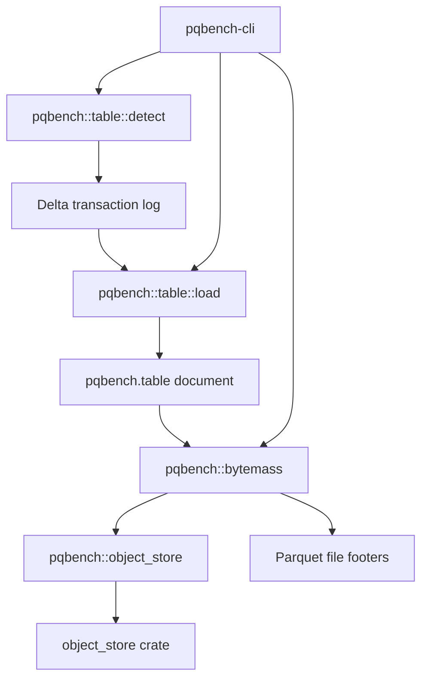

# Delta tables

The `pqbench` library contains an optional Delta Lake table module that detects
a Delta table, loads its transaction log, and names the active Parquet files.
Measurement is a separate step: `pqbench table` emits the document, and
`pqbench bytemass` reads the files. Delta dependencies are feature-gated and
remain out of the default dependency graph.



`pqbench table` names the format before it loads anything. `_delta_log` is
Delta; `metadata/version-hint.text` is Iceberg (recognized, not loaded yet).
The Delta loader uses delta-rs to read every remaining JSON commit and to
resolve the snapshot's active files. It names no storage-backend types itself.
The only module that names the `object_store` crate is `pqbench::object_store`,
which adapts it to the small `ObjectReader` interface (`stat` + `read_range`)
the rest of the crate uses.

## Usage

Load the latest snapshot, or an explicit version. A TTY pretty-prints the log;
a pipe writes the full `pqbench.table` document. Enable the feature when
building, running, or testing:

```
cargo run -p pqbench-cli --features delta -- table ./path/to/table
cargo run -p pqbench-cli --features delta -- table ./path/to/table --version 3
cargo run -p pqbench-cli --features delta -- table ./path/to/table | cargo run -p pqbench-cli -- bytemass --json
cargo test -p pqbench --features delta
```

Remote tables are resolved with `delta-s3` (which enables `aws`), and the
active objects are measured from their footers only:

```
cargo run -p pqbench-cli --features delta-s3 -- table s3://bucket/table | cargo run -p pqbench-cli --features aws -- bytemass --json
```

A producer can supply the table URI and vended credentials as
`pqbench.remote-source`; `table` detects the format, loads the log, and the
document carries `env` to `bytemass`:

```
producer | pqbench table | pqbench bytemass
```

## Backends

S3 support is compiled behind the `aws` feature inside `pqbench::object_store`
(the only module that names the `object_store` crate). A URI whose backend is
not compiled in fails at runtime with a message naming the missing feature;
`bytemass` and `pqbench::table` contain no feature flags and no third-party
storage types. Adding another scheme is one arm in the factory plus one
feature.

## Report

`pqbench table` describes the log: every available JSON commit, the snapshot
version, partition columns, and the active files. It excludes vacuumed commit
files that a checkpoint has replaced. `pqbench bytemass` then reports physical
storage of those files: file bytes, physical Parquet rows, compressed and
uncompressed column bytes, codecs, and compressed bytes per row.

## Limitations

The implementation rejects deletion vectors, column mapping, external data
paths, and active files whose size differs from the transaction log. Local path
traversal and symlink escapes are rejected; remote file paths must be relative
to the table root. No partial document is returned on failure.

## Dependencies

Delta resolution delegates to delta-rs 0.32.4, which requires Rust 1.91.1 or
newer. Delta dependencies are only built when the `delta` feature is enabled.
