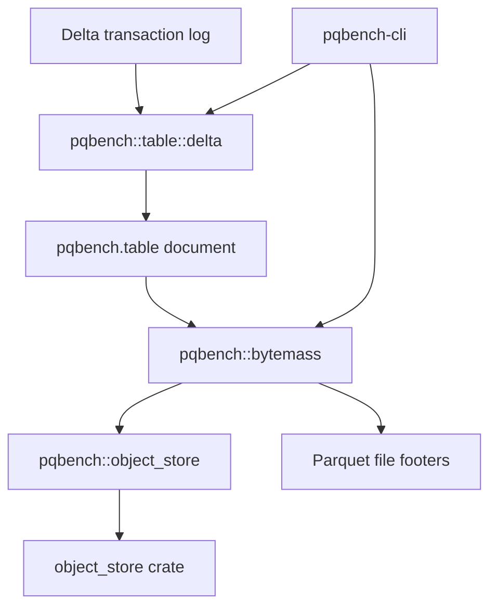

# Delta tables

The `pqbench` library contains an optional Delta Lake table module that detects
a Delta table, loads its transaction log, and names the active Parquet files.
Measurement is a separate step: `pqbench table` emits the document, and
`pqbench bytemass` reads the files. Delta dependencies are feature-gated and
remain out of the default dependency graph.



`pqbench table` names the format before it loads anything. `_delta_log` is
Delta and wins UniForm; Iceberg has its own loader. The Delta module uses
delta-rs to select a table snapshot and names each active file. It does not
measure footers. The only module that names the `object_store` crate is
`pqbench::object_store`, which adapts it to the small `ObjectReader` interface
(`stat` + `read_range`) the rest of the crate uses.

## Usage

Load the latest snapshot, or an explicit version, then measure the named files.
Enable the feature when building, running, or testing:

```
cargo run -p pqbench-cli --features delta -- table ./path/to/table -o table.ndjson.zst
cargo run -p pqbench-cli --features delta -- table ./path/to/table --version 3 -o table.ndjson.zst
cargo run -p pqbench-cli --features delta -- table ./path/to/table | cargo run -p pqbench-cli -- bytemass --json
cargo test -p pqbench --features delta
```

Remote tables are resolved with `delta-s3` (which enables `aws`). Storage
options travel on the document as `env` (`AWS_*` only); they are not written
into the process environment:

```
cargo run -p pqbench-cli --features delta-s3 -- table s3://bucket/table | cargo run -p pqbench-cli --features aws -- bytemass --json
```

A producer can supply the table URI and vended credentials as
`pqbench.remote-source`. `table` detects the format, loads the log, and the
document carries `env` to `bytemass`:

```
producer | pqbench table | pqbench bytemass
```

## Backends

S3 support is compiled behind the `aws` feature inside `pqbench::object_store`
(the only module that names the `object_store` crate). A URI whose backend is
not compiled in fails at runtime with a message naming the missing feature.
Adding another scheme is one arm in the factory plus one feature. The `delta`
feature flag gates the loader; its private `delta_helpers` module is the only
code that names the `deltalake` crate and is plain async. `pqbench table` drives
a load on a current-thread runtime, so delta-rs selects its own executor instead
of borrowing the caller's.

## Document

`pqbench.table` version 1 names the format, the JSON commits that remain on
disk, and the active files (path, URI, log size). On a pipe that is one JSON object per line, each tagged with a table `id`:
`begin`, then `pqbench.table-log` commits, then `pqbench.table-file` rows,
then `end`. `lake` emits `pqbench.table-ref` lines; `table` loads them one at a
time. A table is the work unit: scan a catalog by running one `table` process
per table and letting the shell fan out (`xargs -P`). `bytemass` measures each
file as its line arrives and compares its size to the log. A single
`pqbench.table` object is still accepted. A terminal
prints only the summary (format, snapshot, commit count, file count, bytes)
and requires `-o` to write a zstd stream. On a pipe `-o` is optional and
does not delay stdout:

```
pqbench table ./path/to/table -o table.ndjson.zst | pqbench bytemass
pqbench bytemass table.ndjson.zst
```

## Limitations

Data paths must stay inside the table root (no URIs, no `..`). A missing
`delta` feature fails at runtime and names the feature. Iceberg is detected
from `metadata/version-hint.text` and rejected until a loader exists.

## Dependencies

Delta resolution delegates to delta-rs 0.32.4, which requires Rust 1.91.1 or
newer. Delta dependencies are only built when the `delta` feature is enabled.
