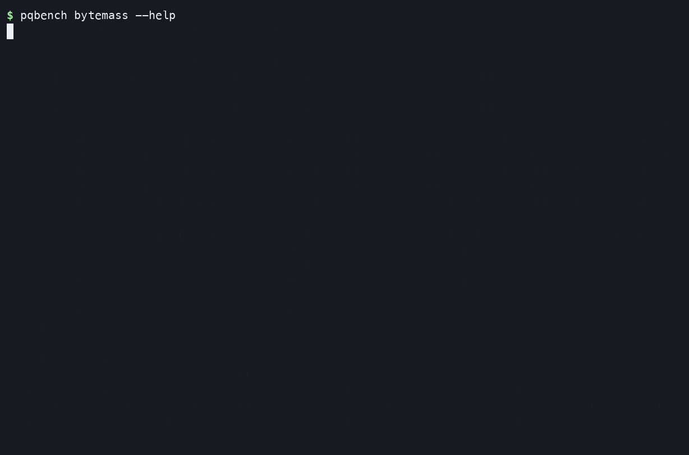
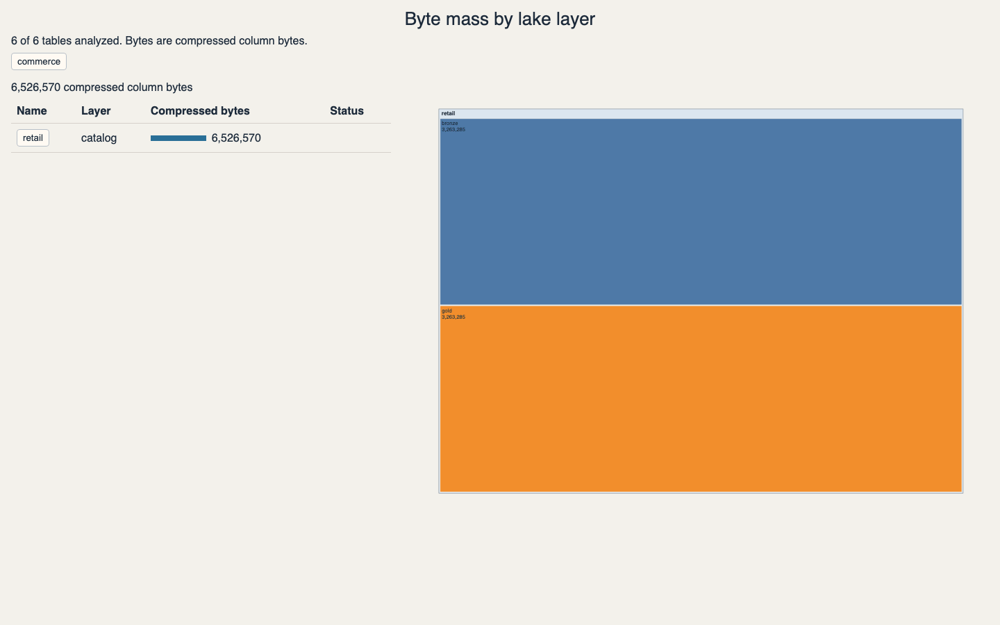
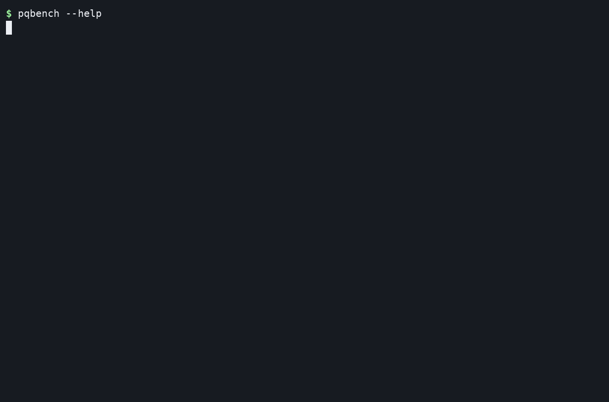
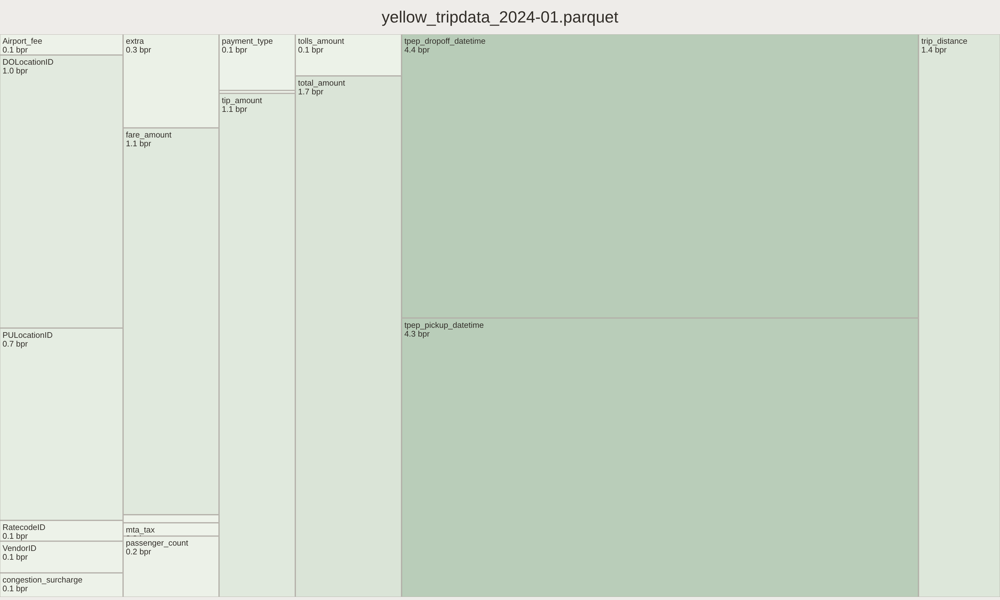
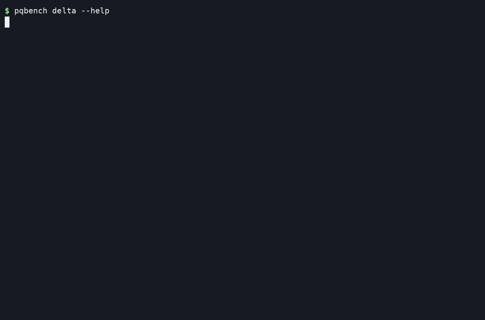

# Visual demos

A lake is a nested list of tables. pqbench measures each table's footers
concurrently and keeps the lake / catalog / schema tree in the report.

The lake walkthrough uses the same `commerce` / `retail` catalog as the
collections work: `bronze` holds raw tables, `gold` holds the curated ones.
Each table carries the same `pqbench.remote-source` document as `--source -`.
The input is [docs/demos/lake.json](demos/lake.json).

Single-file recordings still use the public samples staged under
`.docker-data/` (see [AGENTS.md](../AGENTS.md)):

- **Parquet:** [NYC TLC yellow-taxi trips for January 2024](https://d37ci6vzurychx.cloudfront.net/trip-data/yellow_tripdata_2024-01.parquet)
- **Delta:** [Daft's Stack Exchange sample](https://daft-public-datasets.s3.us-west-2.amazonaws.com/red-pajamas/stackexchange-sample-north-germanic-deltalake/)
  with Danish, Norwegian, and Swedish partitions

## A lake of tables

```sh
pqbench bytemass --collection docs/demos/lake.json --json
pqbench bytemass --collection docs/demos/lake.json --d3 --output-dir reports
```



`--json` writes the same tree with a result on each table. `--d3` embeds that
tree in one page: a layer list plus a two-level treemap. The recording clicks
commerce → retail → bronze → `orders_raw`, then over to gold → `fact_reviews`.



See [collections](collections.md) for the document shape and a Databricks
CLI → `jq` → pqbench pipe.

## One Parquet file

```sh
pqbench bytemass yellow_tripdata_2024-01.parquet
pqbench bytemass 'yellow_tripdata_*.parquet' --json
pqbench bytemass yellow_tripdata_2024-01.parquet --d3 > treemap.html
```



The treemap area is each column's compressed bytes per physical row:



## One Delta snapshot

The `delta` command is feature-gated; build with `--features delta` (the
published Docker image ships without it):

```sh
pqbench delta ./stackexchange-delta
pqbench delta ./stackexchange-delta --version 0 --json
pqbench delta ./stackexchange-delta --d3 > treemap.html
```



The table-level treemap aggregates the active Parquet files selected by the
Delta transaction log:


## Regenerate the terminal recordings

Stage the single-file datasets under `.docker-data/` as documented in
[AGENTS.md](../AGENTS.md), install `asciinema` and `agg`, then run:

```sh
docs/demos/record.sh
```

The script detects the Docker daemon's native ARM64 or AMD64 architecture,
builds `pqbench` with the `delta` feature using persistent,
architecture-specific Cargo volumes, and renders the terminal GIFs.

The lake treemap GIF is a click-through of the interactive `--d3` page.
Recapture it with `docs/demos/capture-lake-treemap.sh` (Chrome + `ffmpeg`).
Single-file D3 PNGs are still browser screenshots; recapture those by hand
when the pages change.
