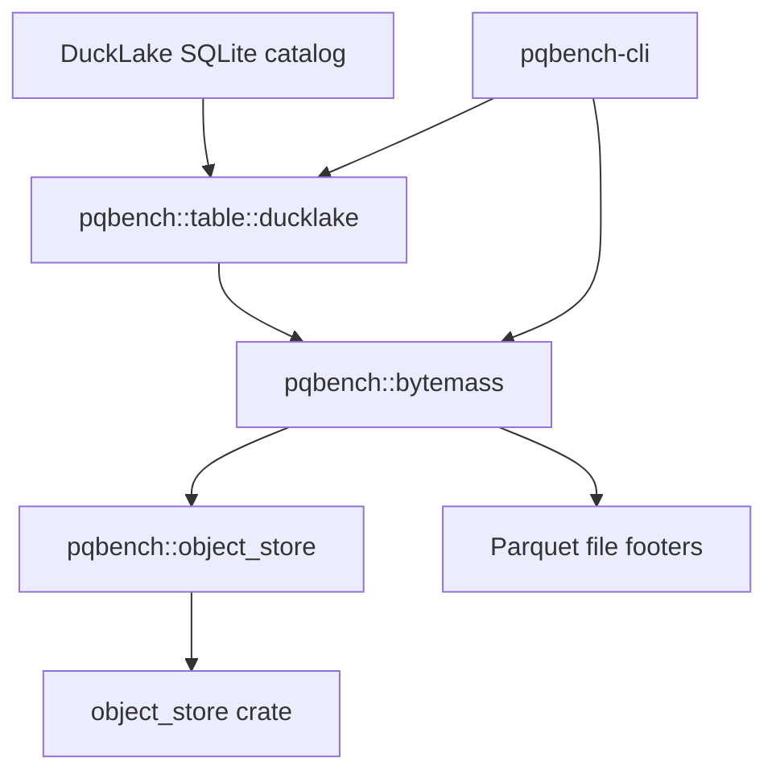

# DuckLake tables

The `pqbench` library contains an optional DuckLake table module that resolves
a snapshot from a local SQLite catalog and orchestrates footer analysis across
its active Parquet data files. DuckLake dependencies are feature-gated and
remain out of the default dependency graph.



`pqbench` reads metadata from individual Parquet files. The DuckLake module
queries the catalog for the selected schema, table, and snapshot, then measures
each active data file from its footer. Delete files are counted and not
applied. The only module that names the `object_store` crate is
`pqbench::object_store`.

## Usage

Analyze the latest snapshot, or an explicit snapshot, from a local catalog:

```
cargo run -p pqbench-cli --features ducklake -- ducklake ./catalog.sqlite --table events
cargo run -p pqbench-cli --features ducklake -- ducklake ./catalog.sqlite --schema main --table events --snapshot 1 --json
cargo test -p pqbench --features ducklake
```

Remote data objects (when `data_path` is `s3://`) are resolved with
`ducklake-s3` (which enables `aws`):

```
producer | pqbench ducklake --source - --table events
```

The source document names the local catalog; storage credentials for the data
files go in `env`.

## Backends

The catalog is always a local SQLite file. S3 support for data files is
compiled behind the `aws` feature inside `pqbench::object_store`. A URI whose
backend is not compiled in fails at runtime with a message naming the missing
feature. The DuckLake module itself contains no storage-backend types.

## Report

The report describes physical storage: active data-file bytes, physical Parquet
rows, compressed and uncompressed column bytes, codecs, and compressed bytes
per row. It also reports delete-file counts, bytes, and deleted rows without
applying those deletes. Catalog metadata and inlined rows are excluded.

## Limitations

The implementation accepts DuckLake format versions 0.3 and 1.x. It rejects
inlined data, encryption, non-Parquet data files, missing or changed files,
path escapes, and delete files that reference inactive data files. DuckDB-native
catalog files are not SQLite and are not opened. No partial report is returned
on failure.

## Dependencies

Catalog queries use rusqlite with bundled SQLite. That dependency is only built
when the `ducklake` feature is enabled.
