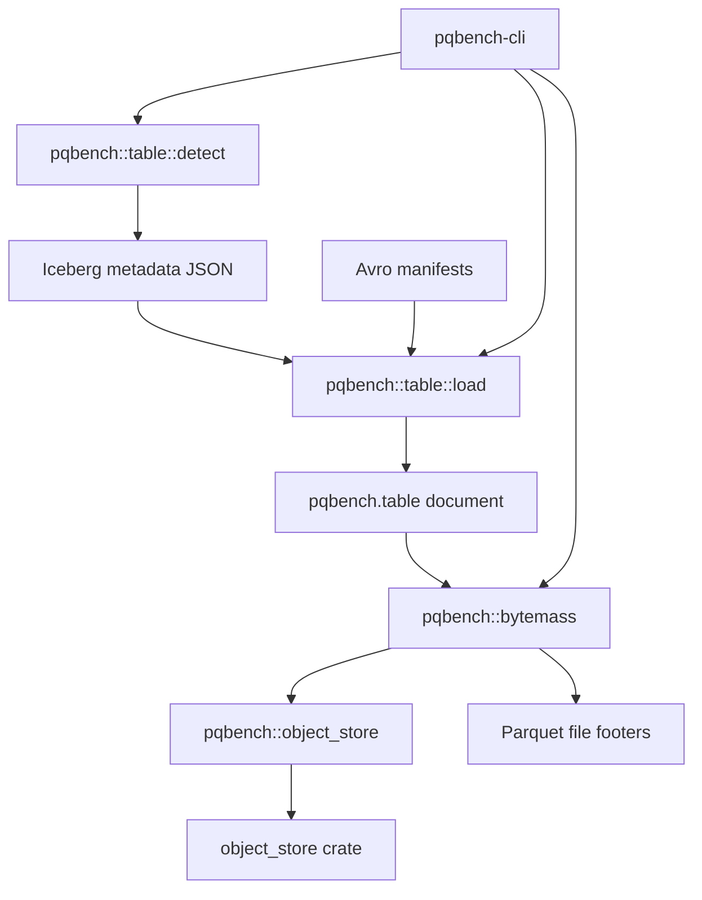

# Iceberg tables

The `pqbench` library contains an optional Iceberg table module that detects an
Iceberg table, loads its metadata JSON and Avro manifests, and names the active
Parquet files. Measurement is a separate step: `pqbench table` emits the
document, and `pqbench bytemass` reads the files. Iceberg dependencies are
feature-gated and remain out of the default dependency graph.



`pqbench table` names the format before it loads anything. Iceberg is recognized
from `metadata/version-hint.text`, `metadata/*.metadata.json`, or a
`.metadata.json` path. The loader reads that metadata and the snapshot's Avro
manifests. Delete files are named in the log and omitted from `files`. The only
module that names the `object_store` crate is `pqbench::object_store`.

## Usage

Load the current snapshot, or an explicit snapshot id. A TTY pretty-prints the
log; a pipe writes the full `pqbench.table` document. The URI may be a table
root or the metadata JSON itself:

```
cargo run -p pqbench-cli --features iceberg -- table ./path/to/table
cargo run -p pqbench-cli --features iceberg -- table ./path/to/table/metadata/v1.metadata.json --version 1
cargo run -p pqbench-cli --features iceberg -- table ./path/to/table | cargo run -p pqbench-cli -- bytemass --json
cargo test -p pqbench --features iceberg
```

Remote metadata and data objects are resolved with `iceberg-s3` (which enables
`aws`). Remote table roots need `metadata/version-hint.text`; otherwise pass the
metadata JSON URI:

```
cargo run -p pqbench-cli --features iceberg-s3 -- table s3://bucket/table | cargo run -p pqbench-cli --features aws -- bytemass --json
```

A producer can supply the table URI and vended credentials as
`pqbench.remote-source`; `table` detects the format, loads the snapshot, and the
document carries `env` to `bytemass`:

```
producer | pqbench table | pqbench bytemass
```

## Backends

S3 support is compiled behind the `aws` feature inside `pqbench::object_store`.
A URI whose backend is not compiled in fails at runtime with a message naming
the missing feature. The Iceberg module itself contains no feature flags and no
third-party storage types.

## Report

`pqbench table` describes the snapshot log, the snapshot id, partition columns,
and the active data files. Delete files appear in the selected snapshot's
actions. `pqbench bytemass` then reports physical storage of those files: file
bytes, physical Parquet rows, compressed and uncompressed column bytes, codecs,
and compressed bytes per row.

## Limitations

The implementation accepts Iceberg format versions 1 and 2. It rejects
non-Parquet data files, data paths outside the table location, and active
files whose size differs from the manifest. Local path traversal and symlink
escapes are rejected. Delete files are not applied. No partial document is
returned on failure.

## Dependencies

Snapshot planning reads metadata JSON with serde and Avro manifests with
apache-avro 0.17. Those dependencies are only built when the `iceberg` feature
is enabled.
