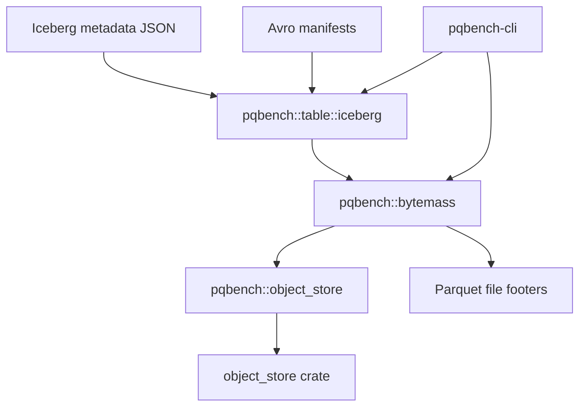

# Iceberg tables

The `pqbench` library contains an optional Iceberg table module that resolves a
snapshot and orchestrates footer analysis across its active Parquet data files.
Iceberg dependencies are feature-gated and remain out of the default dependency
graph.



`pqbench` reads metadata from individual Parquet files. The Iceberg module
reads the table's metadata JSON and Avro manifests to select a snapshot, then
measures each active data file from its footer. Delete files are counted and
not applied. The only module that names the `object_store` crate is
`pqbench::object_store`.

## Usage

Analyze the current snapshot, or an explicit snapshot id, from a metadata JSON
path or URI:

```
cargo run -p pqbench-cli --features iceberg -- iceberg ./table/metadata/v2.metadata.json
cargo run -p pqbench-cli --features iceberg -- iceberg ./table/metadata/v2.metadata.json --snapshot-id 1 --json
cargo test -p pqbench --features iceberg
```

Remote metadata and data objects are resolved with `iceberg-s3` (which enables
`aws`):

```
cargo run -p pqbench-cli --features iceberg-s3 -- iceberg s3://bucket/table/metadata/v2.metadata.json --json
```

A producer can name that metadata location in a source document:

```
producer | pqbench iceberg --source -
```

## Backends

S3 support is compiled behind the `aws` feature inside `pqbench::object_store`.
A URI whose backend is not compiled in fails at runtime with a message naming
the missing feature. The Iceberg module itself contains no feature flags and no
third-party storage types.

## Report

The report describes physical storage: active data-file bytes, physical Parquet
rows, compressed and uncompressed column bytes, codecs, and compressed bytes
per row. It also reports distinct delete files (position and equality) without
applying them. Metadata, manifests, and the table location listing are
excluded.

## Limitations

The implementation accepts Iceberg format versions 1 and 2. It rejects
non-Parquet data files, data paths outside the table location, and active
files whose size differs from the manifest. Local path traversal and symlink
escapes are rejected. No partial report is returned on failure.

## Dependencies

Snapshot planning reads metadata JSON with serde and Avro manifests with
apache-avro 0.17. Those dependencies are only built when the `iceberg` feature
is enabled.
